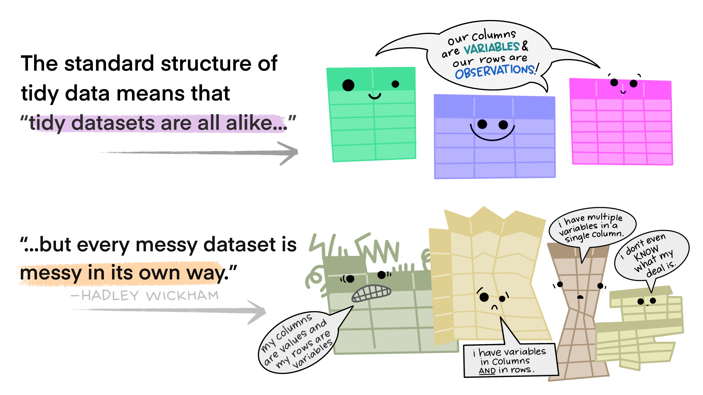
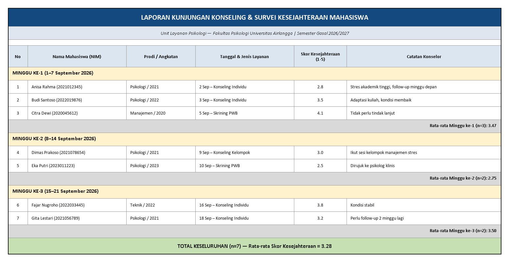

## _Outline_

::: {.incremental}
* **Anatomi tabel** dan dasar-dasar spreadsheet
* **Unit analisis** dan prinsip *tidy data* ([Wickham, 2014](https://doi.org/10.18637/jss.v059.i10))
* Bentuk **panjang (*long*) vs. lebar (*wide*)**
* Studi kasus: menata dataset ***Big Five Personality Test***
* Menyusun tabel ringkasan: **distribusi frekuensi** dan **tabel kontingensi**
* Menyajikan tabel dengan baik
* 2️⃣ aktivitas (mandiri)
:::

::: notes
Sesi ini padat (150 menit) dan banyak *hands-on*. Alokasikan waktu: ±30 menit dasar spreadsheet & tidy data, ±30 menit studi kasus Big Five (termasuk aktivitas kelompok), ±40 menit tabel ringkasan, ±20 menit penyajian tabel, sisanya untuk latihan mandiri dan rekap.
:::

# Anatomi Tabel & Dasar Spreadsheet 📊 {background-color="#14497F"}

## Mengenal tabel

::: {.incremental}
* Hampir semua pekerjaan literasi data, mulai dari data mentah sampai naskah publikasi, **menggunakan sebuah tabel** untuk menyajikan data.
* Minggu lalu kita bicara tentang *Data Pipeline* secara konsep besarnya. Hari ini kita mulai dari tahap *Data Pipeline* yang terakhir dulu ('*Present*') dengan tabel: bagaimana tabel disusun, dibaca, dan diubah bentuknya.
* Ingat definisi minggu lalu: data adalah **representasi dunia yang terstruktur**. Tabel adalah salah satu bentuk struktur itu yang paling umum kita temui.
:::

## Anatomi sebuah tabel

::: {.incremental}
* **Baris (*row*)** — mewakili satu *record*, biasanya berisi informasi tentang satu **unit analisis** (mis. satu partisipan, satu sekolah, dst.).
* **Kolom (*column*)** — mewakili satu **variabel**, misalnya usia, gender, atau skor pada satu item skala.
* **Sel (*cell*)** — pertemuan satu baris dan satu kolom, diidentifikasi lewat sistem referensi (kolom → huruf, baris → angka): sel `B3` berarti kolom B, baris 3.
:::

::: {.callout-tip}
### Baris merupakan unit yang granular
Baris idealnya mewakili informasi paling rendah levelnya dan paling detail. Jadi, bukan ringkasan atau subtotal. 
:::

## Fungsi dan formula dasar

Formula selalu diawali tanda `=`:

* `=B3+B8` — menjumlahkan dua sel
* `=SUM(B3:B8)` — menjumlahkan rentang sel (tanda `:` berarti "sampai dengan")
* `=AVERAGE(B3:B8)` — rata-rata satu rentang
* `=COUNT(B3:B8)` — menghitung berapa sel berisi angka

**Fungsi** adalah kalkulasi siap pakai bawan dari *spreadsheet* — lebih ringkas daripada menulis `=B3+B4+B5+B6+B7+B8` secara manual.

::: {.callout-note}
### Kenapa ini relevan?
Skor total skala kepribadian yang akan kita pakai hari ini (mis. skor *Extraversion*) pada dasarnya adalah `=AVERAGE()` dari 10 item. Ini adalah satu formula yang sama akan Anda pakai berkali-kali sepanjang semester ini.
:::

# Unit Analisis dan Prinsip *Tidy Data* 🧹 {background-color="#14497F"}

## Tabel yang dirancang untuk dibaca manusia...

...seringkali **bukan** tabel yang siap dianalisis komputer. Perhatikan dua tabel berikut, keduanya tentang hasil panen buah:

::: columns
::: {.column width="50%"}
**Tabel A — per hari**

| Hari | Jeruk | Apel | Buah Naga |
|---|---|---|---|
| Senin | 10 | 12 | 15 |
| Selasa | 15 | 14 | 16 |
| Rabu | 15 | 11 | 19 |
:::
::: {.column width="50%"}
**Tabel B — per bulan**

| Bulan | Jeruk | Apel | Buah Naga |
|---|---|---|---|
| Januari | 453 | 637 | 234 |
| Februari | 456 | 674 | 245 |
:::
:::

::: {.fragment}
**Apa bedanya?** Bukan variabelnya (sama-sama jeruk, apel, buah naga) — tapi **unit analisisnya**: Tabel A per hari, Tabel B per bulan.
:::

## Unit analisis harus jelas dan konsisten

Setiap baris harus mewakili **satu unit analisis yang benar-benar unik**. Dua tips penting:

::: {.incremental}
1. **Beri nomor unik (*unique identifier*)** pada tiap baris. Kalau tabel hanya berisi nama hari, bagaimana Anda membedakan hasil panen hari Selasa minggu ini dengan minggu depan?
2. **Urutkan data dengan aturan yang konsisten** dan sesuai konteks — misalnya berdasarkan ID, tanggal, atau besaran nilai — bukan asal-asalan.
:::

::: {.callout-note}
### Penting diingat
Dalam riset psikologi, *unique identifier* ini biasanya adalah **ID partisipan** — bukan nama, demi menjaga anonimitas sekaligus memudahkan pelacakan data longitudinal.
:::

## Mana yang lebih tepat?

::: columns
::: {.column width="50%"}
**Diurutkan berdasarkan ID**

| ID | Hari | Jumlah |
|---|---|---|
| 001 | Senin | 37 |
| 002 | Selasa | 49 |
| 003 | Rabu | 45 |
:::
::: {.column width="50%"}
**Diurutkan berdasarkan nilai**

| ID | Hari | Jumlah |
|---|---|---|
| 001 | Senin | 37 |
| 003 | Rabu | 45 |
| 002 | Selasa | 49 |
:::
:::

::: {.fragment}
Tidak ada jawaban universal, ini sangat **tergantung tujuan Anda**. Apakah Anda ingin melacak entri berdasarkan urutan pengumpulan? Maka, urutkan berdasarkan ID. Kalau ingin cepat melihat nilai ekstrem? Maka, urutkan berdasarkan nilai.
:::

## Prinsip *tidy data*

::: {.callout-important}
### [Wickham (2014)](https://doi.org/10.18637/jss.v059.i10) — tiga aturan *tidy data*
1. **Satu kolom memuat satu variabel.**
2. **Satu baris mewakili satu unit analisis (*case*).**
3. **Satu tabel mewakili satu observational unit.**
:::

Dengan *tidy data*:

::: {.incremental}
* Lebih mudah membuat visualisasi
* Memudahkan eksplorasi dan pemfilteran data
* Lebih mudah "dibersihkan" (Pertemuan 4)
* Tidak berantakan ketika Anda perlu melakukan koreksi atau penyesuaian
:::

::: notes
Ini prinsip paling penting di keseluruhan pertemuan ini — sering diulang di pertemuan berikutnya (cleaning, analysis). Pastikan mahasiswa benar-benar paham tiga aturannya sebelum lanjut ke long vs wide.
:::

## *Tidy data*

## *Tidy data*

# Bentuk Panjang vs. Lebar 🔄 {background-color="#14497F"}

## *Long* vs. *wide format*

::: columns
::: {.column width="50%"}
***Long form* (panjang)**

* Tiap variabel mendapat kolom sendiri — paling sesuai prinsip *tidy*.
:::
::: {.column width="50%"}
***Wide form* (lebar)**

* Tiap baris berisi seluruh hasil observasi dari satu unit analisis, biasanya untuk **pengukuran berulang**.
* Cocok untuk melihat tren dari waktu ke waktu (data *longitudinal*/*time series*).
:::
:::

## Contoh: *long form*

| Nama | Waktu | Jumlah Makanan (gr) |
|---|---|---|
| Kucing A | Senin | 100 |
| Kucing A | Selasa | 120 |
| Kucing B | Senin | 123 |
| Kucing B | Selasa | 125 |

Satu baris = satu observasi (satu kucing, pada satu waktu tertentu).

## Contoh: *wide form*

| Nama | Senin | Selasa |
|---|---|---|
| Kucing A | 100 gr | 120 gr |
| Kucing B | 123 gr | 125 gr |

::: {.fragment}
Sama-sama penyajian data yang valid, tapi bentuk *wide* di sini melanggar aturan *tidy* nomor 1 (kolom "Senin" dan "Selasa" sebenarnya sama-sama variabel "jumlah makanan", cuma dipisah berdasarkan waktu).
:::

::: {.callout-caution}
### Bukan berarti tabel *wide* selalu salah
*Wide format* tetap berguna untuk **presentasi** (mis. tabel ringkasan di naskah publikasi). Yang penting: gunakan *long format* untuk **analisis**, dan konversi ke *wide* kalau perlu untuk **penyajian** (Pertemuan 7).
:::

# Studi Kasus: Dataset Big Five Personality Test 🧬 {background-color="#14497F"}

## Menerapkan prinsip tadi ke dataset kita

Ingat dari Pertemuan 1 — dataset dari **Open-Source Psychometrics Project** yang akan kita pakai sampai Pertemuan 7. Strukturnya:

::: {.incremental}
* Tiap **baris** = satu partisipan (unit analisis) yang mengisi survei daring.
* Tiap **kolom** = satu variabel: 50 kolom item kepribadian (`E1`–`E10`, `N1`–`N10`, `A1`–`A10`, `C1`–`C10`, `O1`–`O10`), plus kolom demografis (`age`, `gender`, `country`, dst.).
* Setiap sel berisi **satu nilai**: respons 1–5 pada skala Likert, atau satu nilai demografis.
:::

::: {.fragment}
Apakah struktur ini *tidy*? **Ya** — satu variabel per kolom, satu partisipan per baris, satu tabel untuk satu jenis observasi (respons survei).
:::

## Tapi "tidy" ≠ "siap pakai"

Dataset ini tidy secara struktur, tapi untuk **dianalisis sebagai skor kepribadian**, kita masih perlu mengubahnya:

| Sebelum (level item) | Sesudah (level skala) |
|---|---|
| `E1, E2, E3, ..., E10` (10 kolom) | `skor_extraversion` (1 kolom) |
| `N1, N2, N3, ..., N10` (10 kolom) | `skor_neuroticism` (1 kolom) |

::: {.fragment}
`skor_extraversion = AVERAGE(E1:E10)` — inilah kenapa formula `AVERAGE()` yang kita bahas di awal tadi sangat penting. *(Beberapa item butuh dibalik skornya dulu/reverse-scored — kita bahas saat membersihkan data di Pertemuan 4)*.
:::

## Tabel "dibaca manusia" vs. tabel "siap dianalisis"

Bandingkan dua cara menyajikan ringkasan skor kepribadian yang sama:

::: columns
::: {.column width="50%"}
**Untuk dibaca manusia** *(laporan)*

| Trait | Skor Rata-rata |
|---|---|
| Extraversion | 3.4 |
| Neuroticism | 2.9 |
| Openness | 3.8 |
:::
::: {.column width="50%"}
**Siap dianalisis** *(dataset)*

| ID | Trait | Skor |
|---|---|---|
| 001 | Extraversion | 3.1 |
| 001 | Neuroticism | 2.7 |
| 001 | Openness | 4.0 |
:::
:::

::: {.callout-note}
### Penting diingat

Tabel kiri cocok untuk **satu** slide laporan (ringkasan seluruh sampel). Tabel kanan menyimpan skor **per partisipan**, per *trait* — inilah bentuk yang bisa difilter, dibandingkan antar kelompok, dan divisualisasikan.
:::

::: notes
Ini contoh hipotetis untuk ilustrasi, bukan angka riil dari dataset. Tekankan bahwa mengubah dari level item ke level skala **juga** merupakan bentuk reshaping — bukan cuma soal long/wide.
:::

## 🧩 Aktivitas kelompok: menata ulang tabel

::: {.callout-warning appearance="minimal"}
Susun kembali tabel "Laporan Kunjungan Konseling & Survei Kesejahteraan Mahasiswa", yang disusun **untuk dibaca manusia** di bawah ini sehingga dapat dianalisis oleh komputer. 
:::

{fig-align="center" width="95%"}

## Perhatikan

::: {.callout-warning}
### Yang harus dipertimbangkan

1. Identifikasi kategori data apa saja yang ada dalam tabel tersebut (mis. ID, minggu, prodi/angkatan, jenis layanan, skor).
2. Sepakati kolom *header* apa yang dibutuhkan agar tabel ini memenuhi tiga aturan *tidy data* — termasuk kolom mana yang sebenarnya harus dipecah jadi dua.
3. Gambarkan (di ppt/Canva/dst.) versi *tidy* dari tabel tersebut.
4. Diskusikan: informasi apa yang "hilang" saat direstrukturisasi, dan bagaimana cara memunculkannya kembali dengan formula?
:::

::: notes
Tabel contoh sudah disiapkan (libs/aktivitas2_tabel_berantakan.png): laporan konseling & survei kesejahteraan mahasiswa dengan baris judul gabungan, baris header per minggu, baris subtotal, dan tiga kolom yang masing-masing menggabungkan dua variabel (Nama+NIM, Prodi+Angkatan, Tanggal+Jenis Layanan). Minta mahasiswa mengenali ketiga pelanggaran ini secara eksplisit.
:::

# Menyusun Tabel Ringkasan 📋 {background-color="#14497F"}

## Tabel distribusi frekuensi

::: {.incremental}
* Memuat **frekuensi** (jumlah kemunculan) dari tiap nilai suatu variabel.
* Cocok untuk **satu variabel** (univariat) — misalnya, berapa banyak partisipan pada tiap kategori usia.
* Memudahkan Anda memvisualisasikan data sebagai *bar chart*, histogram, dsb. (Pertemuan 7).
:::

| Kategori Usia | Frekuensi (n) | Persentase |
|---|---|---|
| 18–22 tahun | 142 | 35.5% |
| 23–27 tahun | 168 | 42.0% |
| 28+ tahun | 90 | 22.5% |

<small>Angka bersifat hipotetis untuk ilustrasi.</small>

## Tabel kontingensi (*cross tabulation*)

::: {.incremental}
* Tabel distribusi frekuensi cocok untuk **satu** variabel — tapi peneliti sering berurusan dengan **dua atau lebih** variabel sekaligus.
* Untuk kasus **dua variabel** (bivariat), **tabel kontingensi** adalah teknik terbaik: menyajikan distribusi frekuensi dari dua variabel dalam format matriks.
* Membantu memperkirakan ada-tidaknya **keterkaitan** antara dua variabel, dan menghitung **probabilitas kondisional**.
:::

## Anatomi tabel kontingensi

::: {.incremental}
* Kolom dan baris mewakili **variabel berbeda**, biasanya **kategorikal**. Misalnya: "gender" sebagai baris, "kelompok skor Extraversion (tinggi/rendah)" sebagai kolom.
* Jumlah baris/kolom mengikuti jumlah **kategori** tiap variabel.
* Umumnya memuat: **total marginal** (*marginal totals*, subtotal baris & kolom), **persentase** (total, kolom, dan/atau baris), serta **jumlah sampel (n)**.
:::

## Contoh tabel kontingensi

| Gender | Extraversion Tinggi | Extraversion Rendah | Total |
|---|---|---|---|
| Perempuan | 120 (60%) | 80 (40%) | 200 |
| Laki-laki | 95 (53%) | 85 (47%) | 180 |
| **Total** | **215** | **165** | **380** |

<small>Angka hipotetis. Persentase di sini dihitung **per baris** (persentase gender dalam tiap kategori Extraversion).</small>

::: {.callout-note}
Kita akan kembali ke tabel seperti ini di Pertemuan 5–6 saat membahas **rencana analisis** dan **membandingkan kelompok**.
:::

## Menghitung probabilitas dari tabel kontingensi {.smaller}

::: columns
::: {.column width="33%"}
**Rasio**

Perbandingan relatif dua nilai; pembilang dan penyebut *tidak harus* berhubungan.

*"Rasio partisipan perempuan dengan laki-laki adalah 200:180."*
:::
::: {.column width="33%"}
**Proporsi**

Perbandingan sebagian dengan keseluruhan; pembilang *termasuk* dalam penyebut. Bisa desimal, pecahan, atau persentase.

*"60% partisipan perempuan memiliki skor Extraversion tinggi."*
:::
::: {.column width="34%"}
**Rate**

Frekuensi suatu kejadian pada populasi dalam periode waktu tertentu — umum dipakai untuk menggambarkan tingkat risiko.

*"15 kasus burnout per 100 mahasiswa per semester."*
:::
:::

::: {.callout-caution}
Ketiganya sering tertukar dalam laporan penelitian — kesalahan ini bisa membuat klaim Anda menyesatkan, apalagi kalau ukuran kelompok yang dibandingkan tidak sama besar (kita bahas kasus nyata soal ini di Pertemuan 6).
:::

## Korelasi lewat tabel kontingensi (*overview* singkat)

Tabel kontingensi juga bisa dipakai menghitung korelasi antar variabel kategorikal (nominal), misalnya *odds ratio*, *Cramer's V*, atau *tetrachoric correlation* — tapi ketiganya **tidak** dibahas mendalam di mata kuliah ini. Cukup ketahui bahwa tabel kontingensi juga berfungsi sebagai alat analisis.

# Menyajikan Tabel dengan Baik 🎨 {background-color="#14497F"}

## Prinsip menyusun tabel

::: {.incremental}
* Pilihan **teknik penyusunan** (alfabetis, berdasar besaran angka, kronologis, dsb.) harus disesuaikan dengan informasi yang ingin ditonjolkan.
* **Judul tabel** harus jelas menggambarkan isi tabel.
* **Judul kolom** harus sesuai dengan data di bawahnya, termasuk satuan pengukuran (mis. tahun, ms, %).
* **Sumber data** dicantumkan jelas di bawah tabel.
:::

## Contoh: penyusunan alfabetis

| Negara | Jumlah Partisipan |
|---|---|
| Filipina | 410 |
| Indonesia | 2.760 |
| Malaysia | 940 |
| Singapura | 780 |
| Thailand | 960 |
| **Total** | **5.850** |

<small>Data hipotetis. Penyusunan alfabetis memudahkan pembaca mencari negara tertentu dengan cepat — cocok ketika tidak ada urutan besaran yang perlu ditonjolkan.</small>

## Hal lain yang perlu diperhatikan

::: {.incremental}
* **Persentase**: hitung dengan perincian yang jelas — persentase dari apa?
* **Unit pengukuran**: selalu cantumkan (tahun, ms, kg, dst.).
* **Catatan kaki (*footnote*)**: untuk keterangan tambahan yang tidak muat di judul.
* Gaya tabel mengikuti **panduan penulisan ilmiah** bidang Anda — psikologi umumnya mengikuti gaya **APA** ([American Psychological Association, 2020](https://apastyle.apa.org)), yang punya aturan tersendiri soal garis, spasi, dan format tabel.
:::

## Tata letak dan visual tabel

::: {.incremental}
* Gaya APA umumnya **menghindari garis vertikal** — cukup garis horizontal tegas, biasanya hanya di bawah baris judul kolom.
* Gunakan model "spreadsheet penuh" (garis vertikal + horizontal) hanya jika informasi sangat padat dan sulit dibaca tanpa pembatas.
* **Petunjuk visual** seperti *shading* baris berselang bisa membantu pembaca menyusuri tabel panjang.
* Gunakan **tabular numeral** (font angka berjarak sama, mis. Courier, Lucida Console) agar deretan angka lebih mudah dibandingkan secara visual.
:::

# Penutup {background-color="#14497F"}

## Kesimpulan Pertemuan 2

::: {.incremental}
* Tabel tersusun dari **baris (unit analisis)** dan **kolom (variabel)**, dihubungkan lewat sistem referensi sel.
* Prinsip ***tidy data*** ([Wickham, 2014](https://doi.org/10.18637/jss.v059.i10)): satu variabel per kolom, satu unit analisis per baris, satu tabel per observational unit.
* **Long format** untuk analisis, **wide format** untuk presentasi/pengukuran berulang.
* Dataset ***Big Five*** kita sudah *tidy* di level item, tapi perlu di*reshape* ke level skala (`AVERAGE()`) untuk dianalisis sebagai skor kepribadian.
* **Tabel distribusi frekuensi** (univariat) dan **tabel kontingensi** (bivariat) adalah dua alat ringkasan utama, lengkap dengan rasio/proporsi/*rate*.
* Tabel yang baik punya judul jelas, satuan tercantum, sumber tercantum, dan mengikuti gaya penulisan ilmiah bidang Anda.
:::

## Referensi {.scrollable .smaller}

* American Psychological Association. (2020). *Publication manual of the American Psychological Association* (7th ed.).
* [Open Knowledge Foundation & International Republican Institute. (2021). *Data literacy curriculum*.](libs/okf.pdf)
* Open-Source Psychometrics Project. (n.d.). *Raw data repository*. <https://openpsychometrics.org/_rawdata/>
* Wickham, H. (2014). Tidy data. *Journal of Statistical Software, 59*(10), 1–23. <https://doi.org/10.18637/jss.v059.i10>

## Ada pertanyaan❓

{fig-align="center"}

::: {.callout-note}
### Catatan

* Paparan disusun dengan menggunakan  dan [**Quarto**](https://quarto.org) dengan *template* dari [UNAIR Theme](https://github.com/rameliaz/quarto-unair-theme).
* Kontak saya via <i class="fas fa-paper-plane"></i> <a href="mailto:amelia.zein@psikologi.unair.ac.id">amelia.zein@psikologi.unair.ac.id</a>
:::
