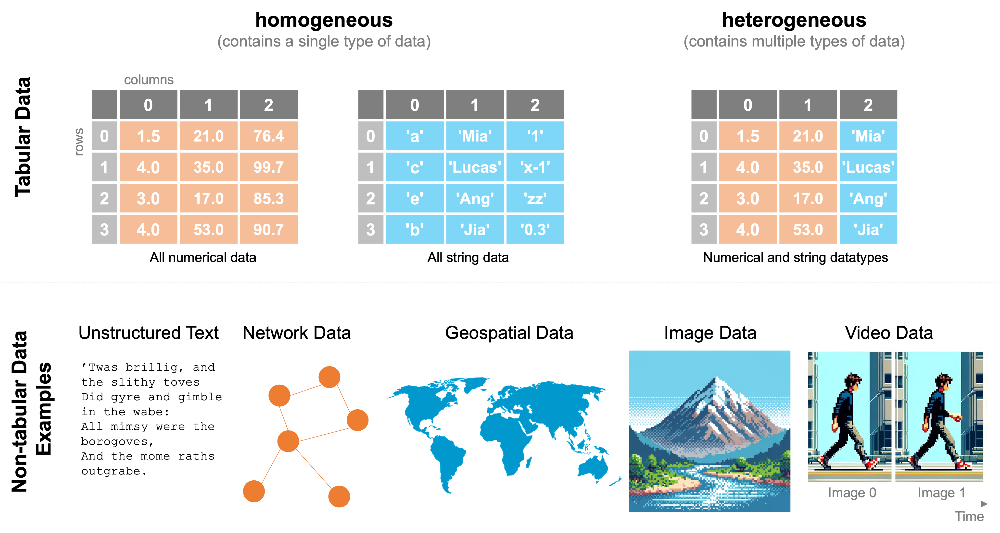
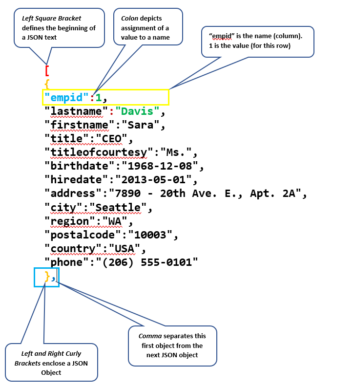

## Agenda {.agenda-slide}

1. ***Find*** & ***Get***: dua tahap *Data Pipeline* yang dibahas minggu ini
2. Sumber-sumber **data terbuka** untuk riset psikologi
3. Ragam **format data** (`.csv`, `.sav`, `json`) dan cara membacanya
4. Mengekstraksi data dari **dokumen dan tabel** dari *file* statis
5. **Etika** pengumpulan dan penggunaan data, termasuk UU Pelindungan Data Pribadi

::: notes
Metode minggu ini "Diskusi Kelompok" — porsi diskusi/kasus etika di bagian akhir sebaiknya diberi waktu lebih banyak daripada bagian format/ekstraksi data yang sifatnya lebih informatif.
:::

# Find & Get: Mencari dan Memperoleh Data 🔎 {background-color="#14497F"}

## Mengingat kembali *Data Pipeline*

Minggu lalu Anda belajar mempresentasikan data dengan tabel. Mulai minggu ini, kita fokus pada tahapan *Data Pipeline*: **Find** (menemukan) dan **Get** (memperoleh) data (Open Knowledge Foundation, 2021).

. . .

Sebelum ada yang bisa ditata atau dibersihkan, harus ada data dulu di tangan Anda.

. . .

::: {.callout-note appearance="simple"}
Kalau Anda benar-benar mencoba mencari dataset psikologi yang relevan dengan topik riset Anda, Anda akan menyadari betapa terbatasnya pilihan data terbuka untuk bidang psikologi kalau dibandingkan, misalnya, dengan ekonomi atau kesehatan masyarakat.
:::

## 3️⃣ pertanyaan sebelum mencari data

::: {.incremental}
1. **Di mana** datanya berada?
2. Dalam **format** apa data itu tersimpan?
3. Apakah data itu perlu **diolah** dulu sebelum bisa dipakai?
:::

## Di mana data bisa ditemukan?

::: {.incremental}
* **Portal data terbuka** — antarmuka web yang dirancang khusus untuk berbagi dataset yang bisa dipakai ulang (mis. [*Open-Source Psychometrics Project*](https://openpsychometrics.org/_rawdata/), [*Open Science Framework*/OSF](https://osf.io/)).
* **Sistem digital organisasi** — banyak lembaga riset/universitas menyimpan data, tapi hanya sebagian yang dirilis ke publik.
* [***Application Programming Interface* (API)**](https://en.wikipedia.org/wiki/API) — cara terprogram untuk "menarik" data dari sistem tertentu; berguna kalau Anda butuh data dalam jumlah besar atau *update* berkala.
* **Bebas di halaman web** — data yang hanya ditampilkan sebagai tabel `HTML`, belum dikemas jadi berkas yang siap diunduh.
:::

## Sumber data terbuka untuk psikologi

::: columns
::: {.column width="55%"}
**Open-Source Psychometrics Project**

[`openpsychometrics.org/_rawdata/`](https://openpsychometrics.org/_rawdata/)

* Puluhan dataset hasil pengisian skala psikologi daring
* Sudah diperkenalkan sebagai sumber dataset ***Big Five*** sejak Pertemuan 1
:::
::: {.column width="45%"}
**Daftar dataset psikologi/ilmu sosial**

[Directory of free, open psychological datasets (Brick et al., 2019)](https://docs.google.com/spreadsheets/d/1ejOJTNTL5ApCuGTUciV0REEEAqvhI2Rd2FCoj7afops/edit)

Dokumen kolaboratif komunitas yang mengumpulkan berbagai sumber dataset terbuka di bidang psikologi dan ilmu sosial yang bisa menjadi pilihan untuk mengerjakan tugas UTS Anda.
:::
:::

::: {.callout-tip}
### Sumber lain yang layak dijelajahi
[Open Science Framework (OSF)](https://osf.io/), repositori data milik jurnal (banyak jurnal psikologi kini mewajibkan *data availability statement*, dan sebagian juga mewajibkan data mentahnya dibagikan), dan arsip data milik konsorsium riset (mis. [World Values Survey](https://www.worldvaluessurvey.org/), [Wellcome Global Monitor](https://wellcome.org/engagement-and-advocacy/engaging-people/wellcome-global-monitor) untuk data lintas-negara).
:::

## 🧩 Aktivitas mandiri: menjelajahi sumber data

::: {.callout-warning}
### Kerjakan sendiri (10 menit)
Buka salah satu sumber data terbuka yang baru saja dibahas (*Open-Source Psychometrics Project* atau daftar dataset komunitas).

1. Pilih **satu dataset** yang menarik minat Anda. Idealnya yang relevan dengan topik riset yang Anda minati.
2. Catat: nama dataset, jumlah kira-kira variabel/kolom, dan format berkasnya.
3. Tuliskan **satu pertanyaan riset** yang mungkin bisa dijawab dengan dataset tersebut.
:::

::: notes
Dataset yang ditemukan di sini bisa menjadi kandidat proyek UTS Pertemuan 8 — sampaikan ini ke mahasiswa supaya latihan terasa bermakna, bukan sekadar formalitas.
:::

# Format Data dan Cara Membacanya 📂 {background-color="#14497F"}

## Tipe Data

{fig-align="center"}

## Ragam format data

::: {.incremental}
* **`.csv`/`.tsv`** *(comma/tab-separated values)* — teks polos yang menyimpan tabel; ringan, terbuka, dan bisa dibaca hampir semua perangkat lunak.
* **`.xls`/`.xlsx`** — format spreadsheet Excel; menyimpan tabel plus format visual dan formula, sehingga kurang ideal untuk dibagikan sebagai data mentah dibandingkan CSV.
* **`.sav`** — format *native* **SPSS**, paling umum Anda temui di penelitian psikologi; menyimpan data plus label variabel dan value labels (mis. `1 = Laki-laki`, `2 = Perempuan`).
* **`.json`** — format ringan berbasis struktur *tree* (bukan tabel), umum dipakai untuk data dari API atau media sosial.
:::

## Tabel (`.csv`/`.xlsx`) vs. *tree* (`.json`): Apa perbedaannya?

::: columns
::: {.column width="50%"}
**Struktur tabular**

* Anda langsung tahu berapa kolom yang dibutuhkan.
* Cocok kalau semua data "pas" masuk ke kolom yang sama untuk setiap baris.
* Ini adalah struktur yang kita pakai sepanjang mata kuliah ini.
:::
::: {.column width="50%"}
**Struktur *tree* (JSON)**

* Setiap "titik" (*node*) bisa punya jumlah nilai yang berbeda-beda.
* Cocok untuk data yang jumlah elemennya tidak tetap — mis. daftar komentar pada satu unggahan media sosial, yang jumlahnya beda-beda tiap unggahan.
:::
:::

::: {.callout-note}
Untuk sebagian besar data riset psikologi (respons survei, skor tes), struktur **tabular** sudah cukup. `.json` lebih relevan kalau Anda bekerja dengan data media sosial atau hasil ekstraksi dari API (Open Knowledge Foundation, 2021).
:::

## Format `json`

{fig-align="center"}

## Membaca `.sav` tanpa `SPSS`

::: {.incremental}
* Anda tidak selalu perlu lisensi `SPSS` untuk membaca `.sav` karena `jamovi` dan `JASP` (keduanya gratis) bisa membukanya langsung.
* Spreadsheet (Google Sheets/Excel) **tidak bisa** membuka `.sav` secara langsung — perlu dikonversi dulu ke `.csv`/`.xlsx` lewat `jamovi`/`JASP`.
* Perhatikan **value labels**: kolom yang terlihat berisi angka (`1`, `2`) sering kali punya label tersembunyi (`Laki-laki`, `Perempuan`) yang perlu Anda periksa di *variable view*, bukan hanya *data view*.
:::

# Mengekstraksi Data dari Dokumen dan Tabel 📄 {background-color="#14497F"}

## Kapan Anda butuh ekstraksi

Tidak semua data terbuka tersedia dalam format siap pakai. Kadang Anda hanya menemukan data dalam:

::: {.incremental}
* **`PDF` digital** — teksnya bisa disorot/disalin, tapi tabelnya sering berantakan kalau disalin langsung ke spreadsheet.
* **`PDF` hasil pindai (*scanned*)** — sebenarnya berupa gambar, kontennya tidak bisa disalin sama sekali tanpa bantuan tambahan.
* **Halaman web (`HTML`)** — data tampil sebagai tabel di browser, tapi belum ada tombol "unduh."
:::

## Strategi ekstraksi sesuai formatnya

| Sumber | Strategi |
|---|---|
| PDF digital dengan tabel rapi | Salin manual (tabel pendek), atau *software* ekstraksi tabel khusus (mis. [Tabula](https://tabula.technology/)) untuk tabel panjang/berulang |
| PDF hasil pindai (*scan*) | Perlu [*Optical Character Recognition* (OCR)](https://cloud.google.com/use-cases/ocr?hl=id) — perangkat lunak yang "membaca" gambar menjadi teks, meski hasilnya sering perlu dikoreksi manual |
| Tabel di halaman web | Fungsi `IMPORTHTML()` di [Google Sheets](https://support.google.com/docs/answer/3093339?hl=en) bisa langsung menarik tabel/daftar dari sebuah URL ke spreadsheet Anda. [Contoh klik di sini.](https://docs.google.com/spreadsheets/d/1dmXKbWZ1Am4XQp-Lbc6aYNA7gyCm8IMUBFljXVYDo9k/edit?usp=sharing) |

::: {.callout-caution}
### Ekstraksi otomatis tidak pernah 100% sempurna
Selalu **verifikasi** hasil ekstraksi terhadap sumber aslinya, karena baris yang terlewat atau kolom yang bergeser adalah kesalahan umum. Inilah kenapa tahap *Verify* (Pertemuan 4) dilakukan setelah *Get*.
:::

# Etika Pengumpulan dan Penggunaan Data 🔐 {background-color="#14497F"}

## Kenapa etika data penting bagi peneliti

::: {.incremental}
* Bahkan ketika Anda **tidak** mengumpulkan data sendiri, hanya mengunduh dataset terbuka, Anda tetap memikul tanggung jawab etis atas bagaimana data itu digunakan.
* Di Indonesia, kerangka hukumnya diatur dalam [**Undang-Undang Nomor 27 Tahun 2022 tentang Pelindungan Data Pribadi (UU PDP)**](https://jdih.komdigi.go.id/produk_hukum/view/id/832/t/undangundang+nomor+27+tahun+2022).
:::

## UU PDP: definisi penting

::: {.callout-important}
### Pasal 1
* **Data Pribadi** — data tentang orang perseorangan yang teridentifikasi atau dapat diidentifikasi, baik sendiri maupun dikombinasikan dengan informasi lain.
* **Subjek Data Pribadi** — orang perseorangan yang datanya melekat/terkait dengannya (mis. partisipan riset Anda).
* **Pengendali Data Pribadi** — pihak yang menentukan tujuan dan melakukan kendali atas pemrosesan data (bisa jadi ini Anda, sebagai peneliti).
:::

## Hak subjek data pribadi (ringkasan)

::: {.incremental}
* Mendapatkan **informasi** tentang tujuan dan dasar penggunaan datanya
* **Memperbaiki** data yang salah/tidak akurat
* Mendapatkan **akses** dan salinan datanya
* **Menghapus** atau mengakhiri pemrosesan datanya
* **Menarik kembali persetujuan** yang telah diberikan
:::

::: {.callout-note}
Hak partisipan untuk mengundurkan diri kapan saja, yang selalu disebut dalam formulir *informed consent* riset psikologi, berakar pada etika riset (Deklarasi Helsinki, kode etik APA dan HIMPSI). UU PDP memberi landasan hukum tambahan untuk aspek datanya.
:::

## Dasar pemrosesan data: persetujuan (Pasal 20–22)

::: {.incremental}
* Pengendali Data Pribadi **wajib** punya dasar hukum sebelum memproses data — salah satunya adalah **persetujuan eksplisit** dari subjek data.
* Persetujuan harus disampaikan **tertulis atau terekam**, dan Pengendali Data Pribadi wajib menjelaskan: legalitas pemrosesan, tujuannya, jenis data yang diproses, jangka waktu penyimpanan, dan hak subjek data.
* Formulir *informed consent* yang Anda tanda tangani (atau minta ditandatangani partisipan) sebelum penelitian dimulai berakar pada etika riset; ketentuan ini menambahkan lapisan hukum untuk aspek pemrosesan datanya.
:::

## Pengecualian untuk kepentingan penelitian ilmiah

::: {.callout-important}
### Pasal 15
Sejumlah hak subjek data (Pasal 8, 9, 10 ayat (1), 11, dan 13), termasuk hak menghapus data dan menarik persetujuan, **dikecualikan** untuk beberapa kepentingan, salah satunya: **"kepentingan statistik dan penelitian ilmiah"** (ayat (1) huruf e). Pengecualian ini "dilaksanakan hanya dalam rangka pelaksanaan ketentuan Undang-Undang" (ayat (2)).
:::

::: {.fragment}
Pengecualian ini **bukan berarti peneliti leluasa menggunakan data milik partisipan**. Ia memberi ruang kerja bagi peneliti, tapi yang dikecualikan hanya sebagian hak subjek data. Pemrosesan data tetap harus punya dasar hukum (Pasal 20), dan tanggung jawab menjaga kerahasiaan dan penggunaan yang wajar tetap ada di tangan peneliti.
:::

## Menerapkan ini ke dataset contoh

Dataset ***Big Five*** yang kita pakai bersifat **terbuka dan tanpa identitas langsung** (tidak ada nama atau kontak), tapi masih memuat variabel demografis (usia, jenis kelamin, ras, negara, bahasa ibu), dan sebagian respondennya berusia 13–17 tahun. Tapi prinsip etikanya tetap relevan untuk proyek riset Anda sendiri:

::: {.incremental}
* Kalau Anda **mengumpulkan data sendiri** (mis. untuk tesis), formulir *informed consent* dan penyimpanan data yang aman adalah **kewajiban Anda sebagai peneliti**.
* Kalau Anda **memakai data sekunder terbuka**, tetap periksa: apakah dataset tersebut benar-benar sudah dianonimkan? Apakah ada batasan penggunaan dari penyedia data ([lisensi](https://www.howtofair.dk/how-to-fair/data-licences/), atribusi)? *Open-Source Psychometrics Project*, misalnya, tidak mencantumkan lisensi apa pun untuk datanya.
:::

## 🧩 Diskusi kelompok: skenario etika data

::: {.callout-warning}
### Diskusikan bersama kelompok Anda (10 menit)
Coba cek kembali dataset yang Anda kumpulkan dari riset skripsi Anda. Informasi apa saja yang Anda kumpulkan dalam dataset tersebut?

1. Apakah dataset ini "cukup" anonim untuk dipakai bebas? Mengapa/mengapa tidak?
2. Langkah apa yang bisa Anda ambil sebelum menggunakannya dalam naskah publikasi?
3. Kaitkan diskusi ini dengan hak-hak subjek data yang baru kita bahas.
:::

::: notes
Ini kasus tentang *k-anonymity*/*re-identification risk* tanpa perlu istilah teknisnya — cukup bangun intuisi bahwa "sudah tanpa nama" ≠ "sudah anonim". Kalau ada waktu, minta tiap kelompok berbagi satu langkah mitigasi yang mereka usulkan.
:::

# Penutup {background-color="#14497F"}

## Kesimpulan Pertemuan 3

::: {.incremental}
* **Find** dan **Get**: data harus ditemukan dan diperoleh dulu, sebelum bisa ditata atau dibersihkan.
* Sumber data psikologi terbuka: **Open-Source Psychometrics Project** dan [daftar dataset komunitas](https://docs.google.com/spreadsheets/d/1ejOJTNTL5ApCuGTUciV0REEEAqvhI2Rd2FCoj7afops/edit?gid=0#gid=0).
* Format data yang umum: `.csv`, `.xlsx`, `.sav` (format native SPSS), dan `.json` (struktur *tree*, bukan tabel).
* Ekstraksi data dari PDF/HTML selalu perlu **diverifikasi ulang**.
* **UU PDP** memberi kerangka hukum bagi hak subjek data dan dasar persetujuan dengan pengecualian untuk kepentingan penelitian ilmiah, yang tetap menuntut tanggung jawab etis dari peneliti.
:::

## Referensi {.scrollable .smaller}

* Brick, C., Botzet, L., Costello, C., Batruch, A., Arslan, R. C., Kline Struhl, M., Sommet, N., Green, J., Nuijten, M. B., Conley, M. A., Richardson, T., Sorhagen, N., Olsson-Collentine, A., Feldman, G., Feingold, F., Manley, H., Mullarkey, M. C., & Dienlin, T. (2019). *Directory of free, open psychological datasets* [Data set]. OSF. <https://doi.org/10.17605/OSF.IO/TH8EW>
* Open Knowledge Foundation. (2021). [*Data literacy curriculum*](libs/okf.pdf). International Republican Institute.
* Open-Source Psychometrics Project. (n.d.). *Open psychology data: Raw data from online personality tests*. <https://openpsychometrics.org/_rawdata/>
* Republik Indonesia. (2022). *Undang-Undang Nomor 27 Tahun 2022 tentang Pelindungan Data Pribadi*.

## Terima kasih!😊 {.closing-slide}

::: {.closing-subtitle}
Ada pertanyaan?
:::

::: {.closing-contact}

* [ ]{.fa-solid .fa-envelope .fa-fw} [amelia.zein@psikologi.unair.ac.id](mailto:amelia.zein@psikologi.unair.ac.id)
* [ ]{.fa-solid .fa-globe .fa-fw} https://rameliaz.github.io/
* [ ]{.fa-brands .fa-discord .fa-fw} [@rameliaz](https://discord.com/users/807046335613632555)
* [ ]{.fa-brands .fa-keybase .fa-fw} [@rameliaz](https://keybase.io/rameliaz)
* [ ]{.fa-brands .fa-github .fa-fw} [@rameliaz](https://github.com/rameliaz)
:::

::: {.closing-note}
Paparan disusun dengan menggunakan  dan [Quarto](https://quarto.org/) dengan template dari [UNAIR Theme](https://github.com/rameliaz/quarto-unair-theme).
:::
