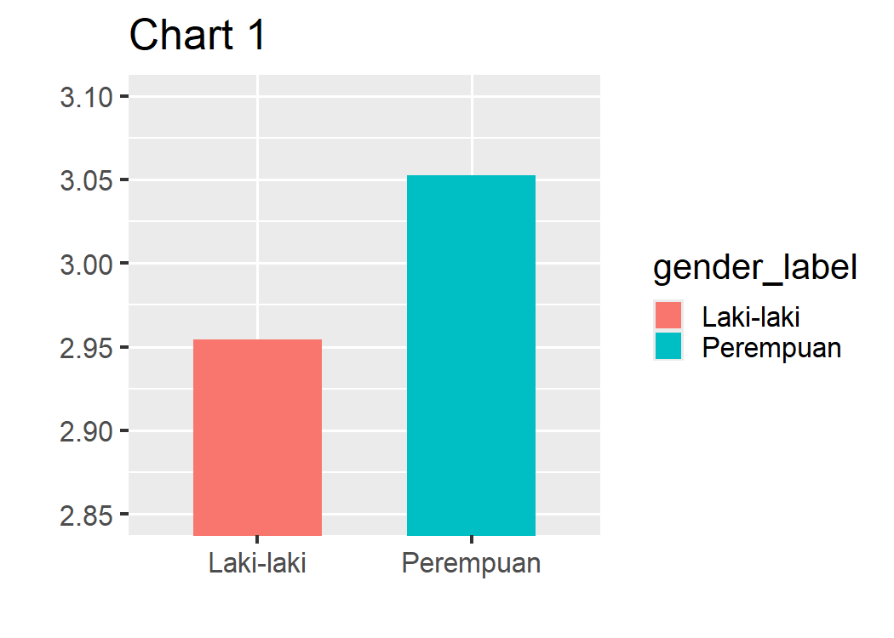
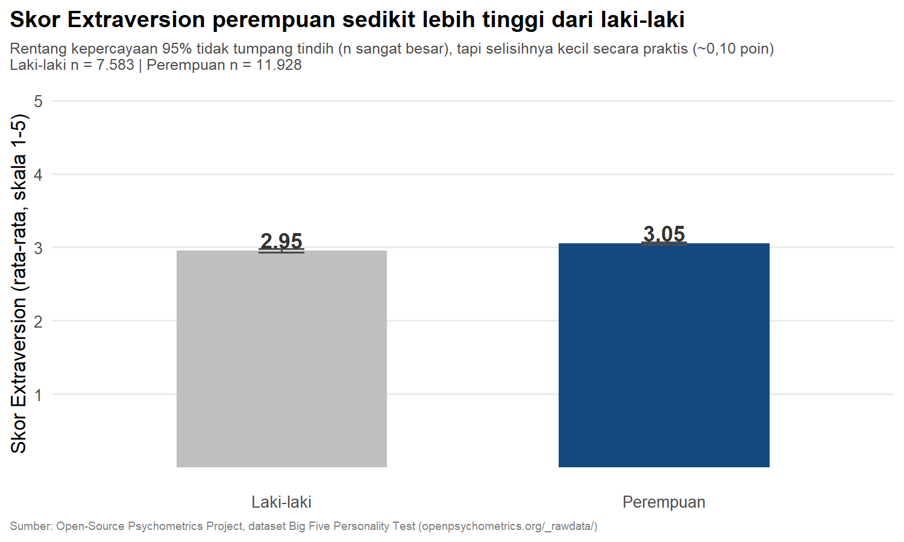

## _Outline_

::: {.incremental}
* ***Presenting*** vs. ***visualizing***
* Memilih jenis data dan **tugas visualisasi** yang tepat
* Enam prinsip *storytelling with data* ([Knaflic, 2021](https://www.storytellingwithdata.com))
* Studi kasus: memvisualisasikan dataset *Big Five*
* Alat bantu: spreadsheet, Tableau/Datawrapper, Canva
* 2️⃣ aktivitas (kelompok & mandiri — mempersiapkan visualisasi UTS Anda)
:::

::: notes
Pertemuan terakhir sebelum UTS (Pertemuan 8) — tekankan sejak awal bahwa keterampilan hari ini langsung dipakai untuk deliverable UTS: laporan singkat + 1 visualisasi.
:::

# *Presenting* vs. *Visualizing* Data 🎨 {background-color="#14497F"}

## Pertanyaan yang salah untuk dimulai

::: {.callout-important}
Pertanyaan pertama yang akan kita selesaikan **bukan** *"bagaimana cara memvisualisasikan data ini?"* — melainkan **"apa yang ingin saya buat audiens saya lakukan/pahami dari data yang saya miliki ini?"**
:::

::: {.incremental}
* Parameter kunci penyajian data adalah **audiens** dan **pesan**, bukan jenis grafik.
* Bagaimana Anda menyajikan temuan riset Anda melalui siaran radio? Atau ke audiens dengan gangguan penglihatan? Atau di komunitas yang tidak familiar dengan grafik? Dalam semua kasus ini, grafik saja tidak cukup.
* Itulah kenapa judul pertemuan ini "**Menyajikan** Data", bukan "**Memvisualisasikan** Data" — visualisasi hanyalah salah satu alat untuk memvisualisasikan data, tetapi bukan tujuan akhir dalam mengkomunikasikan data.
:::

## *Data visualization* vs. infografis

::: columns
::: {.column width="50%"}
**Data visualization**

* Terikat erat dengan data yang mendasarinya.
* Bisa interaktif dan bereaksi terhadap perubahan data.
* Jumlah format yang valid terbatas — harus tetap merepresentasikan data secara jujur.
* [Lihat katalognya di sini (DataViz Catalogue).](https://datavizcatalogue.com/)
:::
::: {.column width="50%"}
**Infografis**

* "Grafik informasi" — menyajikan cerita berbasis fakta secara visual.
* Sering memuat visualisasi data, tapi tidak terikat ketat pada data mentahnya.
* Lebih leluasa secara desain, tapi penggunaannya lebih terbatas pada komunikasi umum (bukan teknis).
* Dapat menjadi produk Jurnalistik Data.
  + [Kompas](https://data.kompas.id/)
  + [Tempo](https://data.tempo.co/)
  + [KataData](https://katadata.co.id/jurnalisme-data), [Contohnya](https://katadata.co.id/infografik/66cfdafdd198f/infografik-degradasi-jumlah-kelas-menengah-indonesia).
:::
:::

## Tiga elemen yang bisa ditonjolkan

::: {.incremental}
1. **Data** — visualisasi sederhana yang membantu audiens cepat menangkap angka kunci; interaktivitas memungkinkan eksplorasi lebih presisi.
2. **Desain** — butuh kepekaan desain, tapi bisa menghasilkan visual yang sangat menarik dan mudah diingat meski datanya sendiri kurang familier.
3. **Pesan** — menempatkan *storytelling* sebagai yang utama; data dan desain melayani narasi yang ingin disampaikan.
:::

# Memilih Jenis Data dan Tugas Visualisasi 📊 {background-color="#14497F"}

## Kategorikal vs. *continuum* (sekali lagi)

Ingat Pertemuan 1: perbedaan data kategorikal dan numerik sekarang menentukan **pilihan grafik** Anda.

::: {.incremental}
* **Data kategorikal** (mis. gender, kelompok skor) — cocok untuk *bar chart*, *pie chart*. Tapi grafik butuh **minimal satu variabel *continuum*** untuk dipasangkan (mis. rata-rata skor per kategori) — tidak mungkin membuat grafik hanya dari variabel kategorikal saja.
* **Data *continuum*** (mis. usia, skor skala) — bisa dipasangkan di kedua sumbu, seperti pada *scatterplot* atau histogram.
* Data *continuum* **bisa** ditampilkan sebagai kategorikal (usia dikelompokkan jadi rentang) — tapi tidak sebaliknya.
* Anda bisa memanfaatkan [ChartChooser](https://www.juiceanalytics.com/chartchooser) untuk menentukan grafik apa yang sesuai dengan tujuan dan jenis data Anda.
:::

## "Saya ingin menunjukkan..."

Cara termudah memilih visualisasi: lengkapi kalimat **"Saya ingin menunjukkan..."**

| Saya ingin menunjukkan... | Tugas visualisasi |
|---|---|
| Jumlah partisipan pada tiap kategori usia | Perbandingan (*comparison*) |
| Proporsi partisipan yang skor Extraversion-nya tinggi vs rendah | Perbandingan, bagian-dari-keseluruhan |
| Perubahan rata-rata skor kesejahteraan dari minggu ke minggu | Perbandingan, pola, data dari waktu ke waktu |
| Sebaran skor Conscientiousness di seluruh sampel | Distribusi |

## Ragam tujuan visualisasi dan grafiknya

::: {.incremental}
* **Perbandingan** → *bar chart*
* **Bagian-dari-keseluruhan** → *pie chart*, *stacked bar chart*
* **Distribusi** → histogram, *box plot*
* **Hubungan** (antara dua variabel kontinu) → *scatterplot*
* **Data dari waktu ke waktu** → *line chart*
* **Lokasi** → peta
:::

::: {.callout-tip}
Tidak ada daftar tugas visualisasi yang baku dan lengkap. satu grafik bisa memenuhi lebih dari satu tujuan sekaligus. Yang penting: **rumuskan tujuannya dulu**, baru pilih grafiknya, bukan sebaliknya.
:::

# Enam Prinsip *Storytelling with Data* 📖 {background-color="#14497F"}

## Kerangka dari Cole Nussbaumer Knaflic

Buku *Storytelling with Data* ([Knaflic, 2021](https://www.storytellingwithdata.com)) merangkum enam prinsip inti untuk penyajian data yang efektif:

::: {.incremental}
1. **Pahami konteksnya**
2. **Pilih visual yang tepat**
3. **Singkirkan kekacauan (*clutter*)**
4. **Arahkan perhatian audiens**
5. **Berpikir seperti desainer**
6. **Ceritakan sebuah kisah**
:::

## 1. Pahami konteksnya

::: {.incremental}
* Siapa audiens Anda? Apa yang sudah mereka tahu? Tindakan/pemahaman apa yang Anda ingin mereka dapatkan?
* Ini gaung langsung dari pembahasan "tiga jenis audiens" di Pertemuan 6. Konteks menentukan segalanya, sebelum Anda menyentuh satu grafik pun.
:::

## 2. Pilih visual yang tepat

Sudah kita bahas di bagian sebelumnya: cocokkan jenis data dan tugas visualisasi dengan bentuk grafik yang tepat — jangan biarkan perangkat lunak "menebak" untuk Anda, karena ia tidak tahu audiens dan konteks proyek Anda.

## 3. Singkirkan kekacauan (*clutter*)

::: {.incremental}
* *Clutter* = elemen visual yang tidak menambah informasi, tapi membebani mata audiens: gridlines tebal, efek 3D, terlalu banyak warna, border berlebihan.
* Aturan praktis: kalau menghapus sebuah elemen tidak mengurangi informasi yang tersampaikan, **hapus saja**.
:::

## 4. Arahkan perhatian audiens

::: {.incremental}
* Mata manusia tertarik secara otomatis pada elemen tertentu (warna kontras, ukuran lebih besar, posisi) — inilah yang disebut *preattentive attributes*.
* Gunakan ini secara sengaja: beri warna berbeda pada satu batang yang ingin Anda tonjolkan, sementara batang lain tetap abu-abu netral.
:::

## 5. Berpikir seperti desainer

::: {.incremental}
* Desain yang baik bukan cuma soal estetika — tapi soal **fungsi**: apakah audiens tahu ke mana harus melihat lebih dulu? Apakah visualisasinya mudah diakses (termasuk untuk audiens dengan keterbatasan penglihatan warna)?
* Prinsip ini menjembatani ke elemen "desain" yang kita bahas di awal pertemuan.
:::

## 6. Ceritakan sebuah kisah

::: {.callout-important}
Data tanpa narasi hanyalah angka. Visualisasi yang baik punya **alur**: situasi awal, ketegangan/temuan yang mengejutkan, dan resolusi/implikasi — persis seperti cerita yang baik pada umumnya.
:::

::: {.fragment}
Ini menyambung ke apa yang sudah kita bahas Pertemuan 6: *hedging language* menjaga kejujuran narasi Anda; prinsip ini memastikan narasi itu juga **menarik** dan mudah diingat.
:::

# Studi Kasus: Memvisualisasikan Dataset *Big Five* 🧬 {background-color="#14497F"}

## Merumuskan tugas visualisasi kita

Kita hitung skor *Extraversion* (setelah item *reverse-scored* dibalik, seperti prosedur Pertemuan 4–5) dari **19.511 partisipan** dalam dataset kita, dipilah berdasarkan gender.

::: {.fragment}
**"Saya ingin menunjukkan"** perbandingan rata-rata skor *Extraversion* antara dua kategori gender → tugasnya adalah **perbandingan** → kandidat grafik: *bar chart* sederhana, dua batang.
:::

::: {.callout-note}
Kedua grafik pada slide berikutnya dibuat dengan **ggplot2** (R) langsung dari `data/data.csv` — bukan angka rekaan. Skripnya ada di `slides/libs/make_pertemuan7_charts.R` kalau Anda ingin melihat/menjalankannya sendiri.
:::

## Sebelum: melanggar hampir semua prinsip *Storytelling*

{fig-align="center" width="85%"}

::: {.incremental}
* Judul generik ("Chart 1") — tidak ada *takeaway*.
* *Gridlines* penuh dan legenda yang sebenarnya tidak perlu (label sumbu-x sudah cukup).
* **Sumbu-y dipotong** mulai dari 2,85, bukan dari 0 — secara visual ini melebih-lebihkan perbedaan kecil menjadi terlihat dramatis.
:::

::: {.callout-caution}
Sumbu-y yang dipotong adalah salah satu cara paling umum (dan paling menyesatkan) untuk membuat perbedaan kecil terlihat besar — persis kebalikan dari *hedging language* yang kita pelajari Pertemuan 6.
:::

## Sesudah: 6️⃣ prinsip diterapkan

{fig-align="center" width="85%"}

::: {.incremental}
* **Judul** langsung menyampaikan *takeaway* (prinsip 6), bukan sekadar label grafik.
* *Gridlines* dan legenda dihapus (prinsip 3); satu warna aksen menonjolkan kelompok yang ingin difokuskan (prinsip 4).
* **Sumbu-y penuh** (1–5, skala Likert aslinya) — perbedaannya terlihat sekecil apa adanya.
* Rentang kepercayaan 95% disertakan (prinsip Pertemuan 6) — nyaris tak terlihat di grafik ini karena `n` yang sangat besar membuatnya sangat sempit.
:::

::: {.callout-important}
### Poin penting: signifikan secara statistik ≠ besar secara praktis
Dengan `n` sebesar ini, CI kedua kelompok **tidak tumpang tindih** — jadi secara statistik perbedaannya *signifikan*. Tapi besarnya cuma ~0.10 poin pada skala 1–5. Judul grafik sengaja memakai *hedging language* ("sedikit lebih tinggi"), bukan klaim yang bombastis. Dalam konteks ini, **presenting** dan **hedging** bekerja bersama.
:::

## Angka di balik grafiknya

Grafik tadi bagus untuk audiens umum, tapi naskah akademik (Pertemuan 6, gaya APA) tetap butuh tabel angka lengkap:

| Gender | n | M | SD | 95% CI |
|---|---|---|---|---|
| Laki-laki | 7,583 | 2.95 | 0.92 | [2.93, 2.97] |
| Perempuan | 11,928 | 3.05 | 0.92 | [3.04, 3.07] |

::: {.callout-note}
Perhatikan tabel ini mengikuti prinsip yang sama dari Pertemuan 2: judul kolom jelas, satuan tersirat dari konteks (skala 1–5), dan sumber datanya (`data/data.csv`, dataset *Big Five*) sudah disebutkan pada slide sebelumnya.
:::

## 🧩 Aktivitas kelompok: kritik sebuah visualisasi

::: {.callout-warning}
### Kerjakan berkelompok (15 menit)
[Perhatikan grafik berikut ini](https://databoks.katadata.co.id/infografik/2025/08/19/10-provinsi-dengan-angka-kemiskinan-tertinggi-awal-2025). Terapkan enam prinsip *storytelling with data* untuk mengkritiknya:

1. Menurut Anda, apa **konteks/audiens** yang dituju grafik ini? Apakah pilihan visualnya cocok?
2. Identifikasi elemen yang termasuk ***clutter*** — apa yang bisa dihapus tanpa mengurangi informasi?
3. Apakah perhatian audiens diarahkan dengan jelas ke bagian terpenting? Bagaimana caranya (atau kenapa tidak)?
4. Apakah ada "kalimat kunci" atau *takeaway* yang bisa langsung dipahami tanpa membaca teks lain?
:::

::: notes
Dua grafik di atas (before/after) sudah bisa langsung dipakai sebagai bahan diskusi kelompok — tidak perlu menyiapkan contoh eksternal lagi. Kalau ada waktu lebih, bawa juga satu contoh dari jurnal/media untuk variasi.
:::

# Alat Bantu Visualisasi 🛠️ {background-color="#14497F"}

## Memilih alat sesuai audiens dan tujuan

::: {.incremental}
* **Grafik *spreadsheet*** (Google Sheets/Excel) — cukup untuk sebagian besar kebutuhan laporan internal dan naskah akademik; mendukung sebagian besar jenis grafik dasar.
* **Tableau, Datawrapper, Infogram** — untuk visualisasi **interaktif**, cocok kalau audiens Anda perlu mengeksplorasi data sendiri (mis. publikasi daring, *dashboard*).
* **Canva** — untuk **infografis**, saat pesan dan desain lebih diutamakan daripada presisi data teknis; ini akan jadi alat utama Anda untuk infografis UAS.
:::

::: {.callout-note}
Kembali ke pembahasan "tiga jenis audiens" (Pertemuan 6): untuk komunitas akademik serumpun → grafik spreadsheet dalam naskah sudah cukup. Untuk publik awam → pertimbangkan infografis Canva. Alat mengikuti audiens, bukan sebaliknya.
:::

# Penutup {background-color="#14497F"}

## Rekap Pertemuan 7

::: {.incremental}
* Mulai dari **audiens dan pesan**, baru pilih visualisasi, dan bukan sebaliknya.
* Rumuskan tugas visualisasi dengan kalimat **"saya ingin menunjukkan..."**, lalu cocokkan dengan jenis data (kategorikal/*continuum*).
* Enam prinsip *storytelling with data*: pahami konteks, pilih visual tepat, singkirkan *clutter*, arahkan perhatian, berpikir seperti desainer, ceritakan kisah.
* Pilihan alat (spreadsheet, Tableau/Datawrapper, Canva) mengikuti audiens dan tujuan penyajian.
:::

## Referensi {.scrollable .smaller}

* Knaflic, C. N. (2021). *Storytelling with data: A data visualization guide for business professionals*. Wiley.
* [Open Knowledge Foundation & International Republican Institute. (2021). *Data literacy curriculum*.](libs/okf.pdf)

## Ada pertanyaan❓

{fig-align="center"}

::: {.callout-note}
### Catatan

* Paparan disusun dengan menggunakan  dan [**Quarto**](https://quarto.org) dengan *template* dari [UNAIR Theme](https://github.com/rameliaz/quarto-unair-theme).
* Kontak saya via <i class="fas fa-paper-plane"></i> <a href="mailto:amelia.zein@psikologi.unair.ac.id">amelia.zein@psikologi.unair.ac.id</a>
:::
